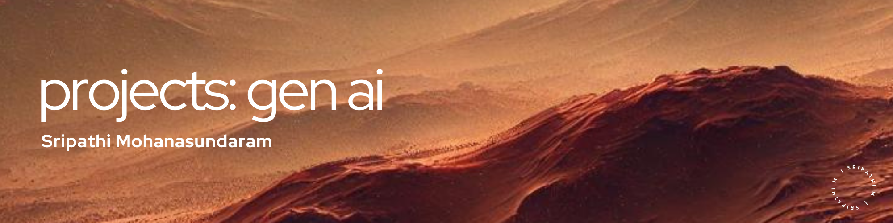

# Mastering the Art of Generative AI
   

## Overview
Welcome to my curated collection of generative AI projects, where creativity meets cutting-edge technology. This repository showcases my journey through the fascinating world of generative models, where each project reflects my commitment to exploring the potential of AI in creating, innovating, and solving complex challenges.

## Project Showcase
Explore a diverse range of projects, from text generation and image synthesis to music creation and beyond. Each project is a testament to the power of generative AI and its transformative impact across various domains.

- **Project 0: [Advanced Prompt Engineering](https://github.com/microize/Projects_Gen_ai/tree/main/00.project_prompt_engineering)**
  - This project highlights advanced prompt engineering techniques applied to solve complex challenges. Key problems addressed include:
    - Planning an entire marketing campaign
    - Designing and planning a product-focused marketing campaign

- **Project 1: [Cyberthreat Detection](https://github.com/microize/Projects_Gen_ai/tree/main/01.text_extraction%3Acyberthreats_detection)**
  - Developed a solution to identify malicious code in user inputs and tackle prompt injection attacks.

- **Project 2: [Data Structurizer Tool](https://github.com/microize/Projects_Gen_ai/blob/main/02.text_extraction%3Adata_structurizer_tool/02.text_extraction%3Adata_structurizer_tool.ipynb)**
  - A tool designed to convert unstructured data into structured data formats.

- **Project 3: [PDF Question and Answering Using Closed Models](https://github.com/microize/Projects_Gen_ai/blob/main/03.rag%3Apdf_question_and_answering/pdf_question_and_answer.ipynbing_openai_apis.ipynb)**
  - Implemented a RAG-based approach using closed-source models from OpenAI to answer questions from PDFs.

- **Project 4: [PDF Question and Answering Using Self-Hosted Models](https://github.com/microize/Projects_Gen_ai/blob/main/04.rag%3Apdf_question_and_answering_local_models/pdf_question_and_answering_local_models.ipynb)**
  - Developed a RAG-based system using self-hosted models rfrom HuggingFace to answer questions from PDFs, with applied quantization to fit models on devices with limited memory.

## About
Dive deep into each project to discover how I've leveraged advanced algorithms and innovative techniques to push the boundaries of what's possible with AI. This repository is more than just code—it's a reflection of my passion for exploring the intricate complexities of machine learning and my relentless pursuit of innovation.

## Usage
Feel free to browse through each project, examine the methodologies, and explore the code. Whether you're a fellow developer, a researcher, or simply curious, there's something here for everyone. If you find these projects inspiring or useful, I'd appreciate it if you could star the repository!

## Contact
For further discussions on potential collaborations or to gain deeper insights into my projects, please feel free to contact me via email at [3sripathi@gmail.com](mailto:3sripathi@gmail.com). Additionally, you can explore more of my in-depth analyses and observations on machine learning on my [Medium blog](https://medium.com/@3sripathi) or connect with me on [LinkedIn](https://www.linkedin.com/in/sripathi-mohanasundaram/).

